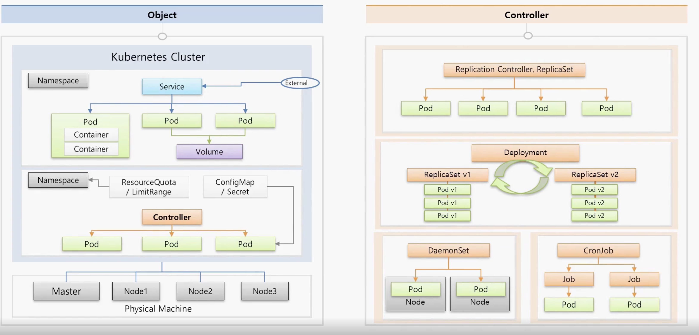

### VM vs Container

---

pod와 service는 연결되어서 동작함

Kubernetes는 서버 1대는 Master, 다른 서버는 Node로 사용
하나의 Master에 여러 Node들이 연결됨

- 이렇게 연결이 되면 Kubernetes Cluster라는 하나의 개념을 이룸

Master는 쿠버네티스의 전반적인 기능들을 컨트롤하고 Node는 자원을 제공하는 역할

Cluster 전체 자원을 늘리고 싶으면 Node를 추가하면 된다.

쿠버네티스 NameSpace는 오브젝트들을 독립된 공간을 가지게 되며 Pod들을 가지고 있음
Pod는 Service와 연결되어 동작하고 외부로 노출시킬 수 있음
Pod에는 각각의 Container들이 존재하고, Pod가 죽을 수 있기 때문에 Volume을 달아서 데이터를 저장함

- Namespace의 물리적인 자원을 제한하기 위해 ResourceQuota 또는 LimitRange를 활용할 수 있음
- 환경 변수 설정이나 외부 파일을 적용하기 위해 ConfigMap / Secret 활용

Pod는 Controller에 의해 제어될 수 있는데 Controller에도 여러 종류들이 존재함

- 장애 대응을 위한 Replication Controller, Set 등등
- 배포를 위한 Deployment Controllere -> 배포 시, 실패할때 롤백 기능을 제공
- 하나의 Node에 하나의 Pod만 존재하는 DaemonSet
- 일정 작업을 위한 주기적으로 진행하기 위한 CronJob

`등등 .. 여러 컨트롤러 타입이 존재`

### References

출처링크 : https://inf.run/yW34
