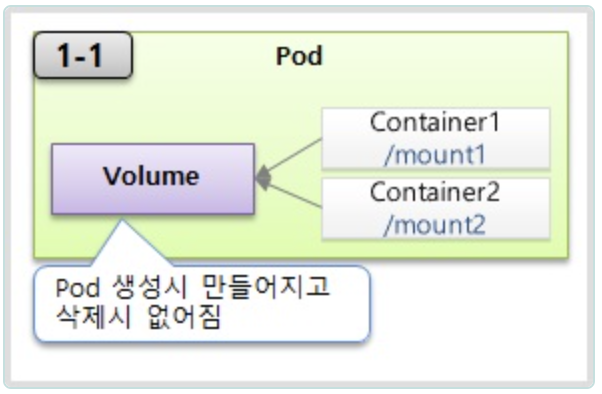

### VM vs Container

---

pod와 service는 연결되어서 동작함

Kubernetes는 서버 1대는 Master, 다른 서버는 Node로 사용
하나의 Master에 여러 Node들이 연결됨

- 이렇게 연결이 되면 Kubernetes Cluster라는 하나의 개념을 이룸

Master는 쿠버네티스의 전반적인 기능들을 컨트롤하고 Node는 자원을 제공하는 역할

Cluster 전체 자원을 늘리고 싶으면 Node를 추가하면 된다.

쿠버네티스 NameSpace는 오브젝트들을 독립된 공간을 가지게 되며 Pod들을 가지고 있음
Pod는 Service와 연결되어 동작하고 외부로 노출시킬 수 있음
Pod에는 각각의 Container들이 존재하고, Pod가 죽을 수 있기 때문에 Volume을 달아서 데이터를 저장함

- Namespace의 물리적인 자원을 제한하기 위해 ResourceQuota 또는 LimitRange를 활용할 수 있음
- 환경 변수 설정이나 외부 파일을 적용하기 위해 ConfigMap / Secret 활용

Pod는 Controller에 의해 제어될 수 있는데 Controller에도 여러 종류들이 존재함

- 장애 대응을 위한 Replication Controller, Set 등등
- 배포를 위한 Deployment Controllere -> 배포 시, 실패할때 롤백 기능을 제공
- 하나의 Node에 하나의 Pod만 존재하는 DaemonSet
- 일정 작업을 위한 주기적으로 진행하기 위한 CronJob

`등등 .. 여러 컨트롤러 타입이 존재`

---

### Container

- Kubernetes Cluster 내에서는 Container에 접근할 수 있는 IP가 자동 할당
- Container는 여러 Port를 가질 수 있지만 하나의 pod내에서 여러 Container가 동일한 Port를 가질 수 없음

### Label

- Key : Value 쌍으로 값을 가짐
- ex) type:web / type:db / type:server
- 하나의 Pod는 **_여러 Label을 가질 수 있음_**

`상용 환경을 담당하는 운영자라고 한다면?`
label이 production이 붙어 있는 Pod들만 Service에 연동하여 해당 운영자에게 전달할 수 있음

즉, 사용 목적에 따라 label을 등록할 수 있는 것이다.

### Node Schedule

- Pod를 생성할때, Node를 직접 선택
- 스케쥴러가 판단하도록 설정할 수 있음

---

### Service

Service는 자신의 Cluster IP를 가지고 있음

- 이 Service를 가지고 Pod를 연결할 수 있음

#### ClusterIP 타입 서비스

Pod의 IP로 접근할 수 있지만 Pod는 유동적임 즉, Pod는 죽었다가 살아날 수 있는데 IP가 변경될 수 있음
따라서 Service를 이용하여 접근

- 따라서, Cluster 내에서 ClusterIP를 통해서 Pod에 접근할 수 있음

대상

- 인가된 사용자
- 내부 대쉬보드
- Pod의 서비스 상태 디버깅

#### NodePort 타입 서비스

모든 노드에 같은 Port를 할당
따라서, 노드에 연결된 Service의 모든 Pod에게 Traffic을 전달할 수 있음

대상

- 내부망 연결, 데모나 임시 연결용

#### Load Balancer 타입 서비스

NodePort와 마찬가지로 모든 노드들에 Port를 할당 해당 Node들에 연결된 서비스의 Pod에 접근
즉 트래픽이 분산될 수 있음

- 단, 외부에 노출할 수 있도록 별도의 External IP 지원 Plugin이 필요함

대상

- 외부 시스템 노출용

### Volume

`emptyDir`

- Pod 내에서 Volume이 생성되기 때문에 Pod가 삭제되면 Volume도 사라짐

`hostPath`

- 각 Node에서 사용할 수 있는 Volume이기 때문에 사전에 해당 Node에서 지정하는 경로가 존재해야함
- 그림과 같이 Pod1이 죽어서 재생성될때 Node2에 생성될 수 있으므로 hostPath는 Node에서 제공하는 데이터가 Pod에서 사용되어야 할때 사용함

`PersistentVolumeClaim & PersistentVolume`

PV의 종류에는 여러가지가 존재한다. NFS, Git, StorageOS .... 등등
하지만 각각의 Type에 따라 Spec과 연결 방법이 다 다름

따라서, 해당 부분은 Cluster 내 Admin 영역으로 구성되어져 있고

Pod를 사용하는 User 영역에서 PVC(Persistent Volume Claim)을 이용해서 PV가 필요할때 연결하면 됨

### ConfigMap, Secret

보안 설정과 Key 때문에 이미지를 Dev와 Prod에 맞게 각각 생성하는 것은 너무 낭비라고 할 수 있다.

- Secret은 Memory를 사용, Container에서 사용될때 자동으로 Decoding됨
- Env(File)와 Mount의 차이 -> Volume이 달려서 Config변수를 사용한다면 값의 변경이 바로 반영됨

secret은 평문으로 쿠버네티스 DB에 저장됨. secret의 보안적 요소는 secret를 pod에 파일로 마운팅해서 사용할 때 Pod 내부에서는 파일이 보이나, 쿠버네티스 입장에서는 workernode에 secret파일을 만들어 놓고,
Pod에 이 파일을 마운팅합니다. 이때 workernode에 secret 파일을 인메모리 파일시스템(tmpfs)영역에 올려놓고 있다가 Pod가 삭제되면 지움. 따라서, 민감한 데이터를 디스크에 저장해 놓지 않기 때문에 configmap보다 보안에 유리할 수 있음

### Namespace, ResourceQuota, LimitRange

- 여러 Resource들을 하나의 Kubernetes Cluster내에서 관리될 수 있음
- Cluster 내에는 여러 개의 Namespace를 생성할 수 있으며, 각각의 Resource를 제한할 수 있음

각각의 Object끼리의 연결은 같은 Namspace 내에서만 연결할 수 있음

- ResourceQuota는 Namespace의 Resource Limit을 명시해주는 Object
- LimitRange는 각각의 Pod마다 Namespace에 들어올 수 있는지 Resource를 확인해줄 수 있는 Object

ResourceQuota는 Namespace 뿐만 아니라 Cluster 전체에 부여할 수 있는 권한이지만, LimitRange의 경우 Namespace내에서만 사용 가능합니다.

### References

출처링크 : https://inf.run/yW34
