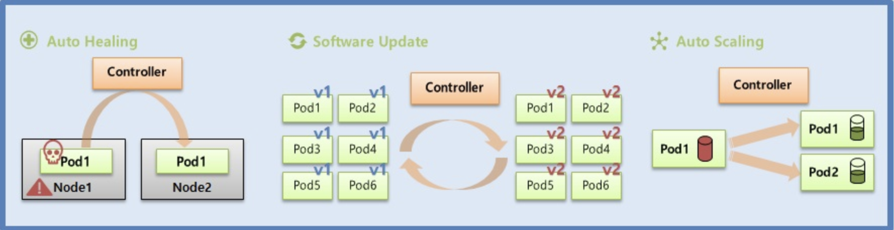
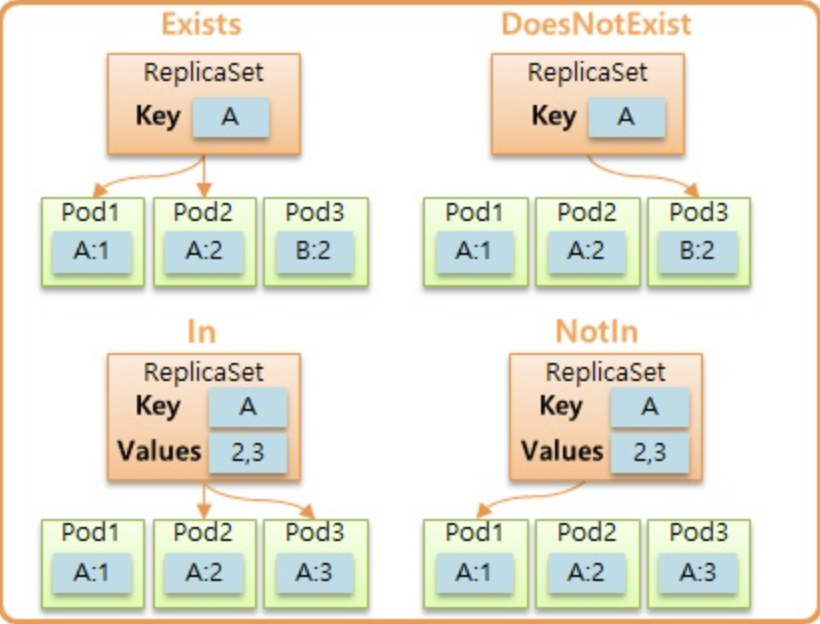
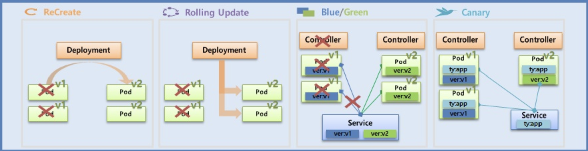
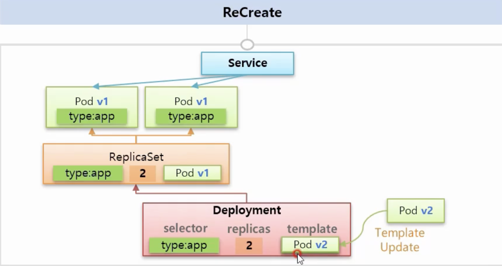
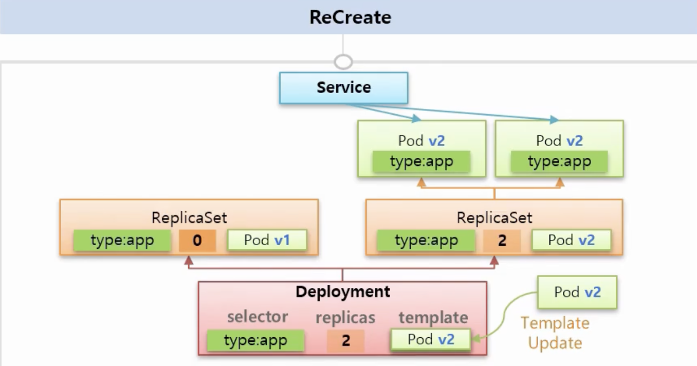
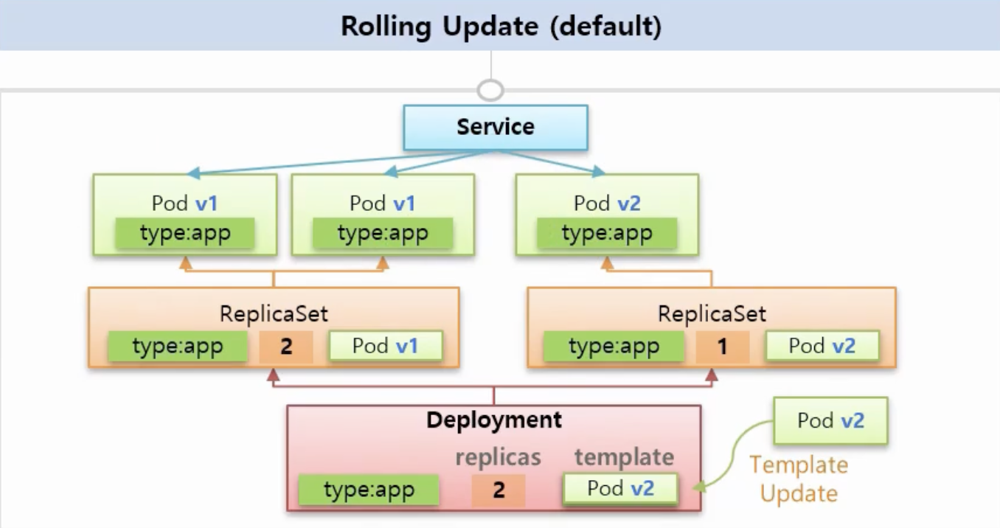
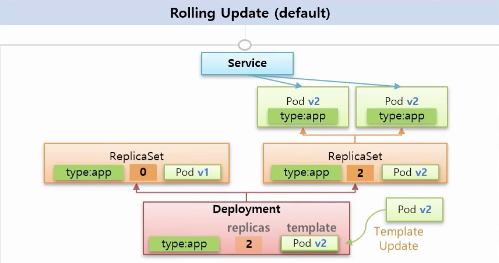
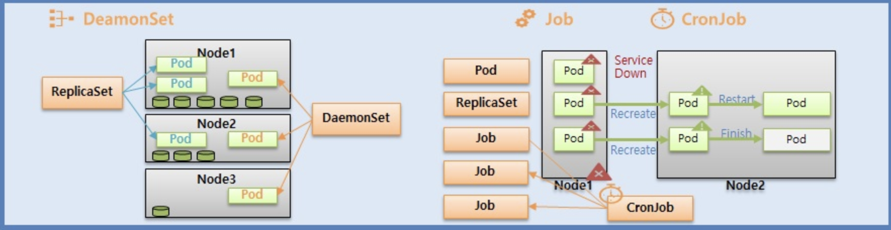

### Controller



- Auto Healing: Node에 있는 Pod가 Node가 죽었을때, 다른 Node에서 동일한 Pod를 재생성해주는 Auto 작업
- Software Update: Software Version에 따라, Pod들이 교체될 수 있도록 컨트롤러가 지원
- Auto Scaling: Pod에서 사용할 수 있는 Resource가 Limit에 도달했을때, 증설

**Replication Controller는 Deprecated 되었음**

Replication 에서는 selector와 template이라는 개념이 존재함

selector는 label에 의해 select 되어지고, template은 해당 selector되는 Pod의 정의를 함

**ReplicatSet에서는 matchExpressions를 지원함**



- 하지만, Controller에서 Pod들을 Select할때는 matchLabels를 많이 사용함

---

```yaml
apiVersion: v1
kind: Pod
metadata:
  name: pod1
  labels:
    type: web
spec:
  containers:
    - name: container
      image: kubetm/app:v1
  terminationGracePeriodSeconds: 0
```

> terminationGracePeriodSeconds 를 통해, Default로 Pod가 종료될때 30초가 걸리는 것을 바로 종료할 수 있음

`컨트롤러가 삭제되더라도 Pod가 그대로 살아있도록 할 수 있는 kubectl 명령어가 존재함`

```shell
kubectl delete replicationcontrollers replication1 --cascade=false
```

그렇다면 Pod들을 관리할 수 있는 Controller를 업데이트 작업을 할 수 있음을 의미함.

## Deployment



### Recreate

Recreate 방식의 배포 버전은 Downtime이 존재한다. 즉, Resource에 대한 점유가 사라지고 서비스를 이용할 수 없는 Time을 의미함



Pod의 version이 1로 배포가 되었을 때, 우리는 개발하면서 version 2로 업데이트를 하고 싶은
상황이 생겼을때, Deployment의 template을 update하면 된다.

그렇게 되면, Deployment는 ReplicaSet의 Replica를 0으로 변경하여 Pod들이 없어지게 됨.
이 때 -> `DownTime이 발생함`



### Rolling Update(default)



Downtime이 존재하는 것이 아니라 Template을 통해 Update를 했을때, 하나의 ReplicaSet을 더 만들어서 v2의 Pod를 운영함 -> 즉, 기존의 Replica 2개를 운영했을때보다 Resource가 증가함

또한, Version이 분산되어 제공됨

이 후, 아래 그림과 같이 기존의 ReplicaSet에서 Pod를 줄여나가면서 완전히 Version이 업데이트 됨
기존의 ReplicaSet을 지우지는 않음


## DaemonSet, Job, CronJob



Object Type에 따라 Node의 장애가 발생했을 때, Service Down되어 새로운 Node에서 Recreate
되는 Object가 존재하고, Recreate가 된다면 Restart 또는 Finish까지 이어지는 작업 종류가 특징에 따라 존재한다.

### DaemonSet

DaemonSet은 기본적으로 각 노드마다 하나의 Pod가 생성됩니다.
예를 들어, 하나의 Kubernetes Cluster에 Node가 10개라면 10개의 Pod가 생성됨

DaemonSet은 Node에 1개 이상의 Pod를 초과할 수 없지만 `nodeSelector를 통해, label 없는 node에는 pod를 안만들 수 있음`

- hostPort를 통해 Node가 다르더라도 Pod에 접근할 수 있음

### Job

template가 selector가 똑같이 존재함

### CronJob

크론 표기식으로 Job을 수행할 수 있음

concurencyPolicy는 Default가 Allow

즉, Job에 대해 정교하게 다룰 수 있음

### References

출처링크 : https://inf.run/yW34
