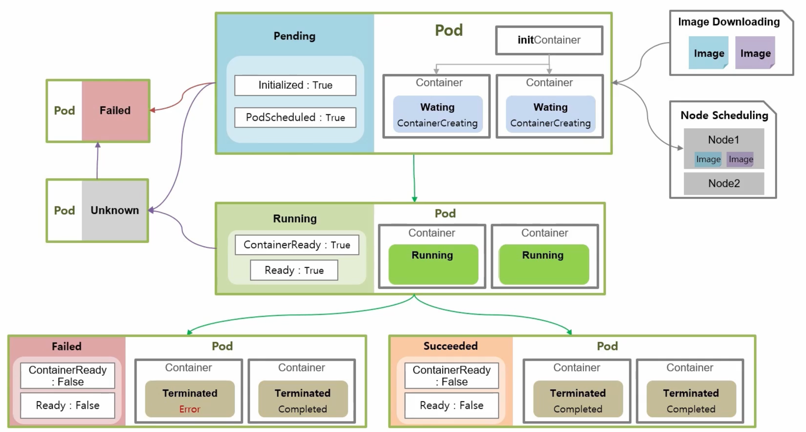
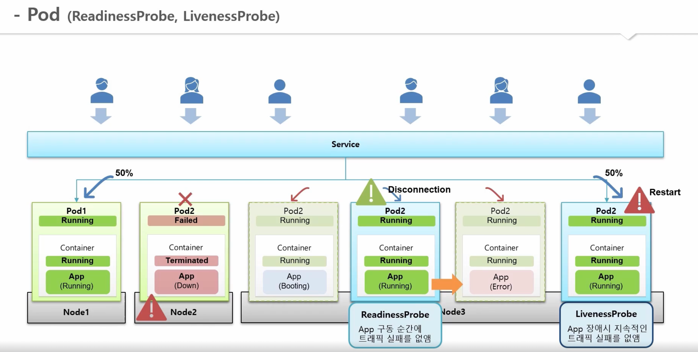
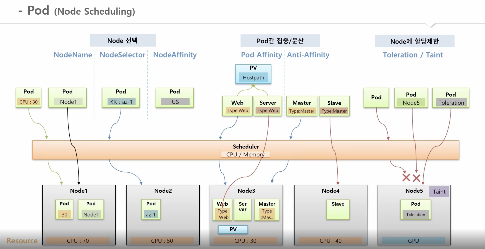
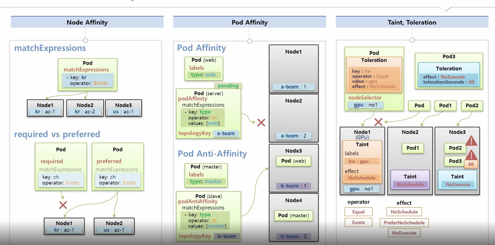

## Pod

### Pod LifeCycle

Pod의 LifeCycle

- Pending 상태일 때, InitContainer를 통해, Image Download, Node Scheduling 등등 작업
- Pod가 Running 상태더라도 Container는 ContainerReady가 false일 케이스도 존재함
- Pod의 Unknown - Container가 죽었거나 통신에 문제가 생겼을때

- Pod가 실행되다가 죽었을때, 즉 Failed 상태가 되었을 때
  ReadinessProbe를 통해, 트래픽 실패를 없애거나
  LivenessProbe를 통해, Pod는 정상이지만, APP이 장애일때 지속적인 트래픽 실패를 없앨 수 있음

### Pod QoS classes(Guaranteed, Burstable, BestEffort)

앱의 중요도에 따라 3가지 단계에 따라 QualityOfService를 제공합니다

특정 설정이 있는건 아니고 containers의 resources에 대해 limit과 request를 통해 지정함

Guaranteed

- Request와 Limit가 설정
- Request와 Limit에는 Memory와 CPU가 모두 설정
- 각 Container 내에 Memory와 CPU의 Request와 Limit의 값이 같음

Burstable

- Request와 Limit이 다른 경우, Request만 설정했거나 Limit가 설정한 경우 등등.

BestEffort

- 어떤 Container 내에도 Request와 Limit 미설정

### Pod (Node Scheduling)

### Node Affinity, Pod Affinity, Taint, Toleration

### References

출처링크 : https://inf.run/yW34
