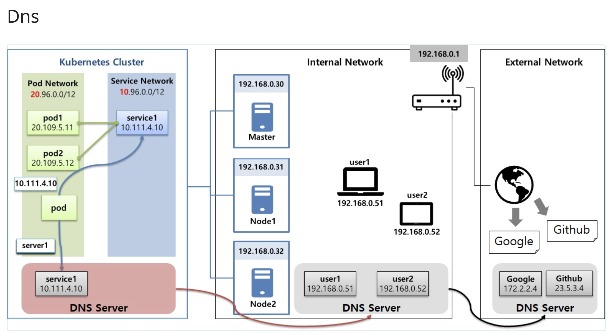
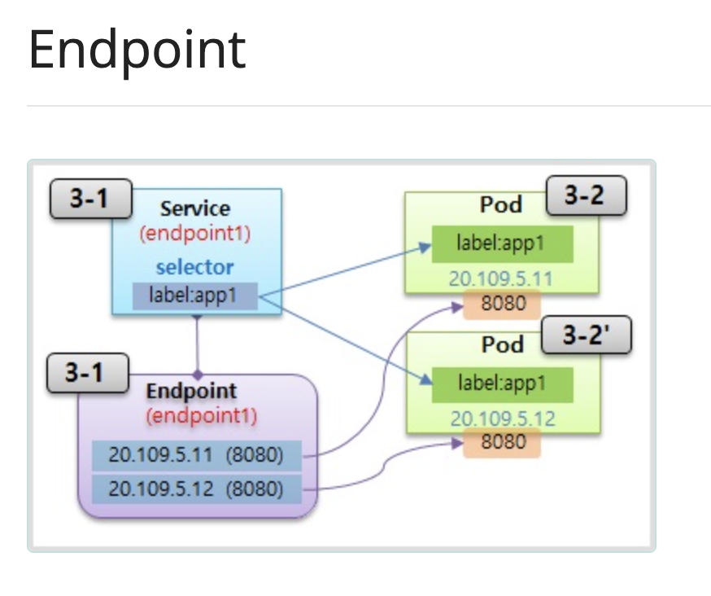
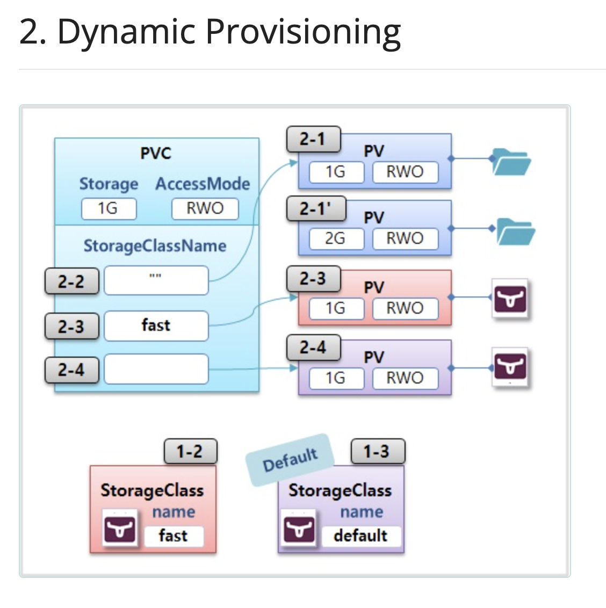
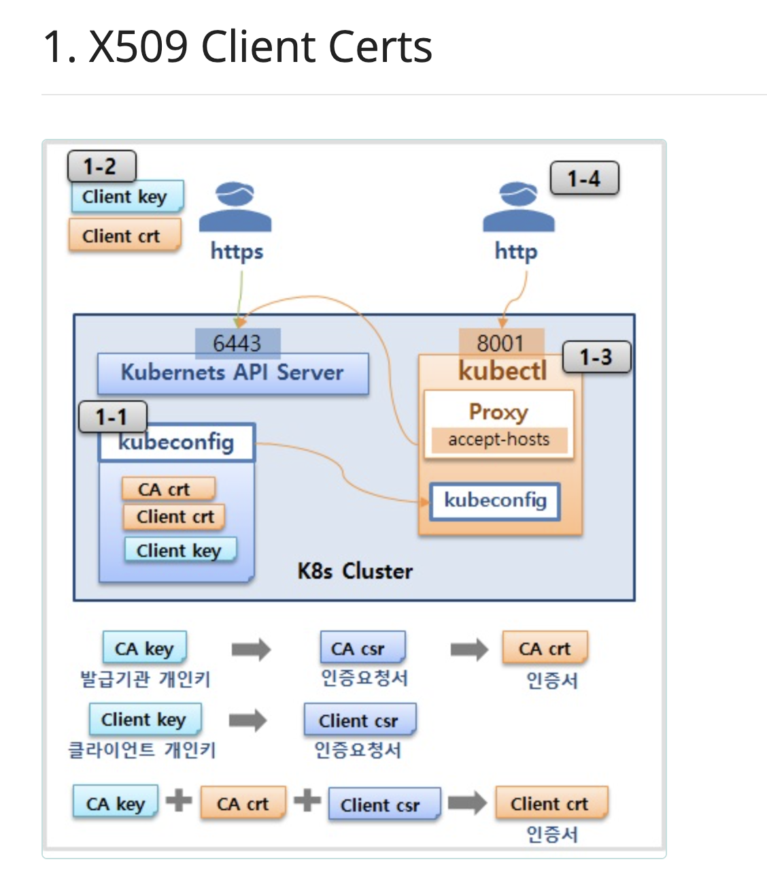

## Service

- ClusterIP로 서비스를 만들어도 클러스터 내 DNS를 이용하여 서비스를 접근할 수 있음
- Headless Service도 존재하는데, 해당 서비스를 만드는 방법은 clusterIP:None으로 지정
- 그렇게 Headless Service를 통해 서비스 내 모든 Pod들의 IP를 DNS로부터 제공받을 수 있음

## EndPoint

> 우리는 기초편에서 Service를 만들고 LabelSelector를 통해서 Service와 Pod가 연결됐음을 알 수 있었다.

`하지만, 실제로는 EndPoint 오브젝트를 통해 실질적으로 연결되는 것이다`

EndPoint는 기본적으로 서비스를 labelSelector와 함께 생성할때, 서비스와 같은 이름으로 생성되고, Pod의 Label을 만들면 Endpoint에 IP가 등록된다.

`이 말은 즉, selector와 label을 생성하지 않고도 Endpoint 오브젝트를 생성하여 수동으로 연결해줄수 있음을 의미함`

**_nslookup으로 도메인의 주소를 알아내서 service의 Endpoint를 수동으로 만들어낼 수도 있음_**

- 해당 외부 서비스가 도메인을 가지고 있다면 ExternalName을 지정해서 서비스를 만들면 됨

## Dynamic Provisioning

- PV를 수동으로 만들때와 PVC를 이용하여 PV를 만들때의 차이

> PV를 수동으로 만들때는 Pod PVC에 연결되기 전까지 Volume이 생성되지 않지만, PVC를 통해 Dynamic Provisioning을 활용하면 Volume이 바로 생성됨

해당 StorageClass를 만들어서 사용할수도 있고 Default Storage Class를 활용할수도 있다.

### Persistent Volume이 Released 되었을때

PV의 Reclaim에 따라 상태가 달라진다.

- Retain: PV를 수동으로 만들었을때 Default, 데이터 보존, 재사용 불가
- Delete: Storage Class를 사용하여 만들었을때 Default, Volume에 따라 데이터 삭제, 재사용 불가
- Recycle: PV가 Available 되면서 재사용가능하나, 현재는 Deprecated

## Accessing API

`Master Node에는 Kubernetes API Server가 존재!`

- Resource를 조회하거나 생성하는데 사용할 수 있음!

또한, Kubernetes API Server에 접근하기 위해 User Account와 Service Account가 존재함

이중에서도 X509 Client Certs를 이용해서 Kubernetes API Server를 접근할 수 있음
CA Key -> CA csr -> CA crt
Client Key -> Client csr

CA Key + CA crt + Client csr -> Client crt

외부에서는 Client Key와 Client crt를 통해 접근할 수 있음

### namespace를 만들면 default service account가 만들어짐
