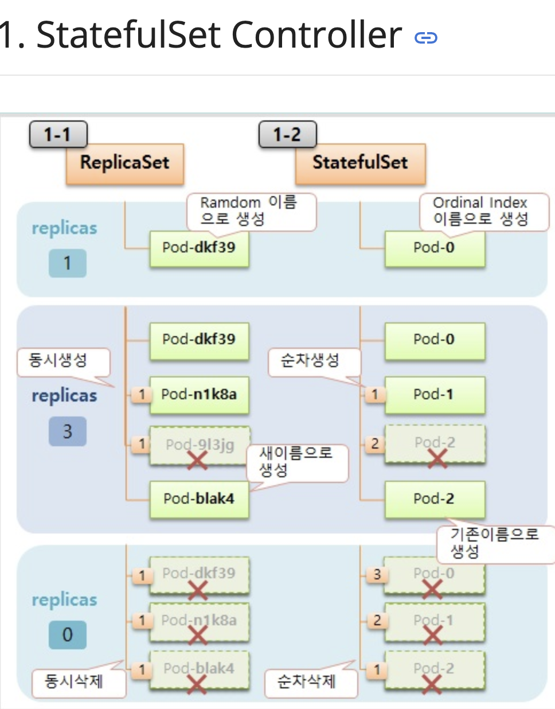
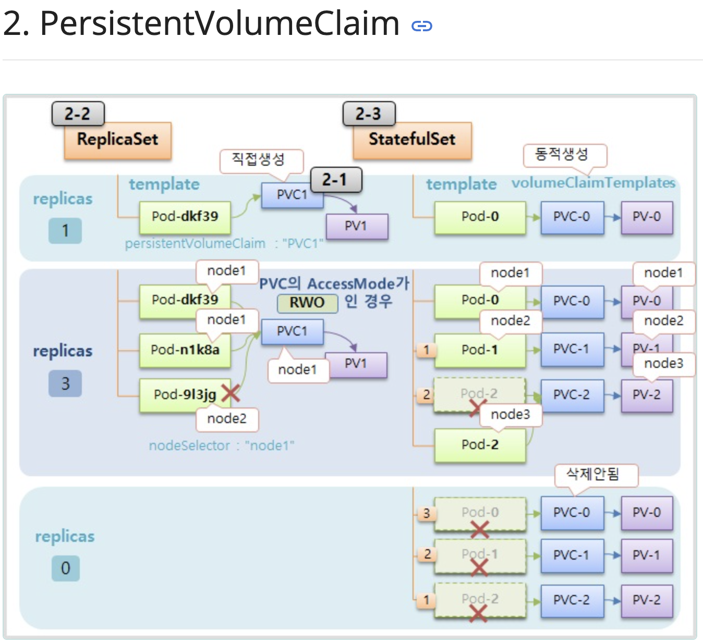
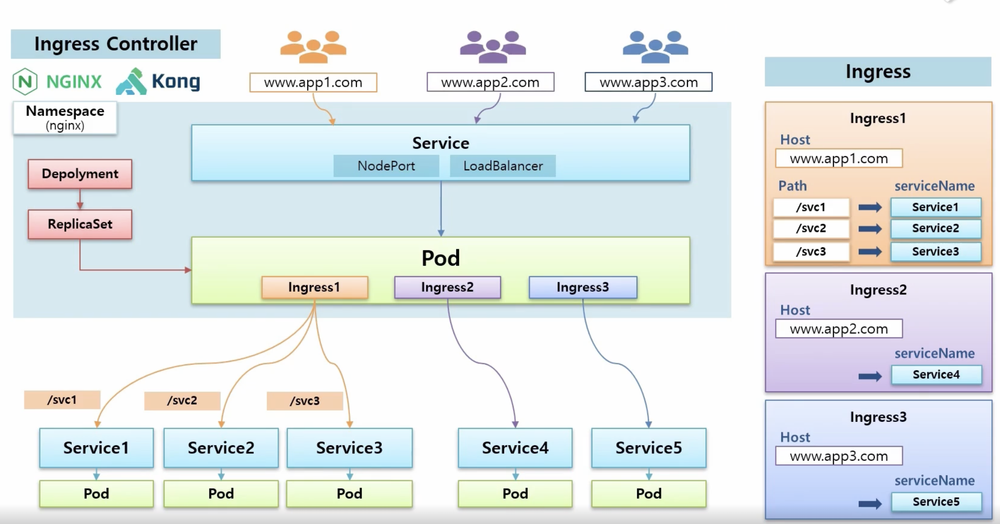
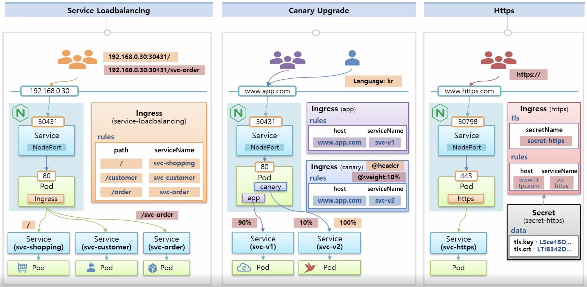
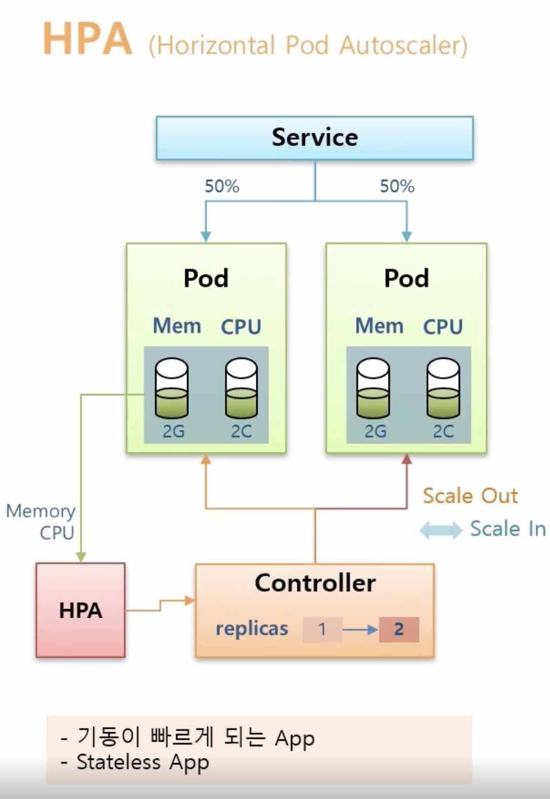
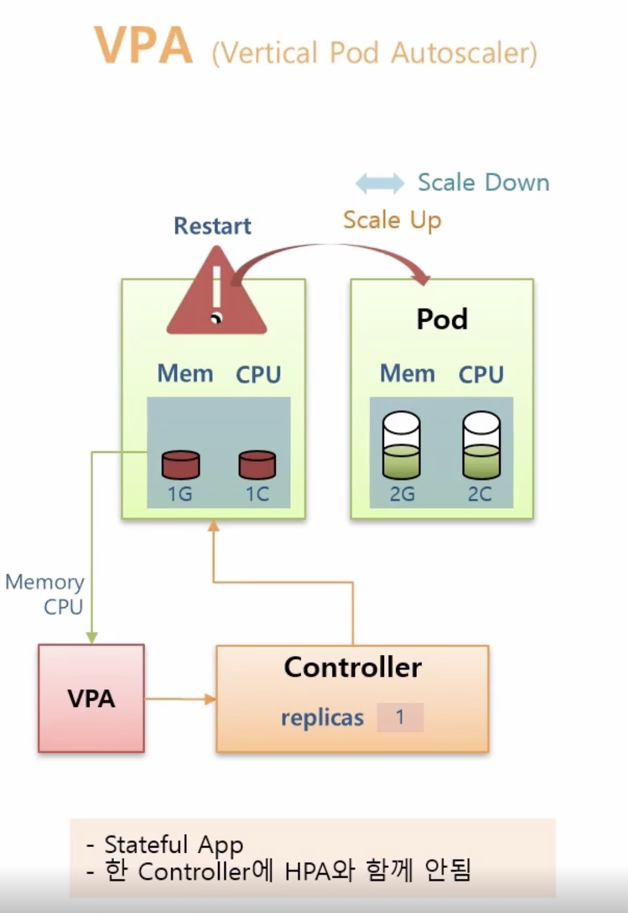
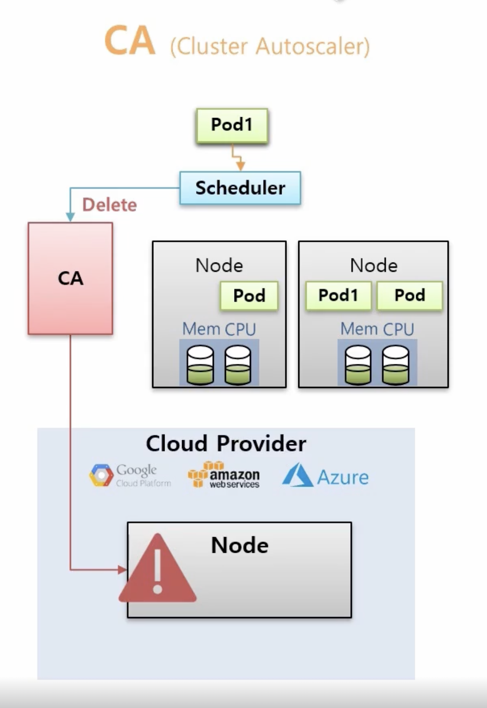
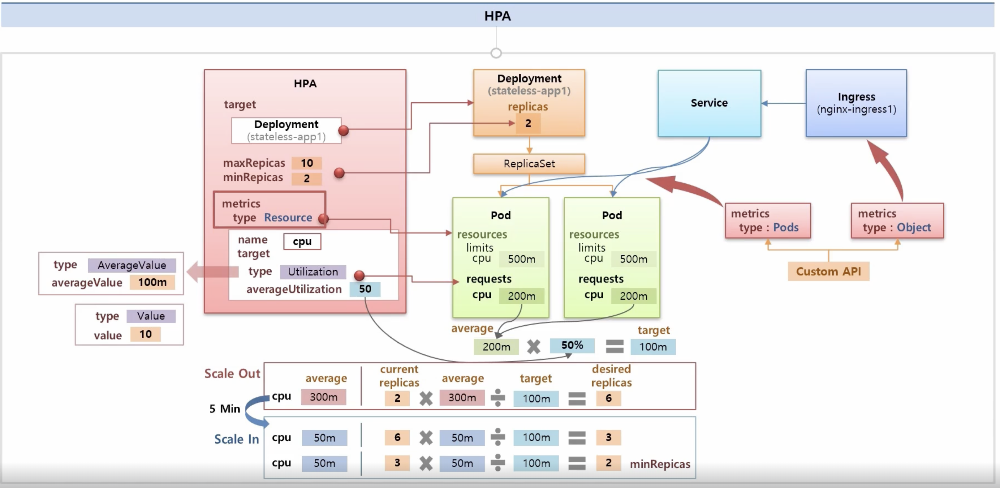

## StatefulSet

대표적으로 Stateless Application이 존재하고 Stateful Application이 존재한다

> Stateless Application: NginX, Apache, IIS

> Stateful Application: mariDB, mongoDB, Redis

Stateless Application 같은 경우, 서비스 장애가 발생하더라도 파드를 새롭게 다시 생성하여 띄우면 됨

하지만 Staetful Application 같은 경우, 각 Pod마다 자신의 역할을 가지고 있어서, 역할에 맡은 Pod가 변경 없이 다시 복구가 되어야 함

그래서, Stateless Application에는 `ReplicaSet` Stateful Application에는 `StatefulSet` 을 달아줌

---

StatefulSet은 Controller의 종류 중 하나이다

**그림과 같은 특징을 가지고 있음**

### PVC 특징

- ReplicaSet인 경우, PVC를 직접 생성하여 pod를 생성할때 지정할 수 있으나, StatefulSet은 Pod를 생성할때 PVC를 동적으로 생성할 수 있다

이 의미는 replicas의 개수를 늘렸을 때 ReplicaSet은 `PVC를 지정했기 때문에` 같은 PV를 선택할 수 있지만 StatefulSet은 동적으로 생성하기 때문에 Pod마다 `각각의 PVC`를 가지고 있고 PV를 가지고 있다

- ReplicaSet인 경우, PVC가 존재하는 node에 Pod가 존재해야 하기 때문에 nodeSelector를 PVC와 동일하게 지정해야 함
- 반대로 StatefulSet은 동적으로 생성하기 때문에 Pod2죽더라도, 다시 생성될 때 동일한 PVC2를 가리키게 됨
- Pod를 삭제할때도 StatefulSet 같은 경우, 데이터가 소멸되면 안되기 때문에 PVC는 삭제되지 않음

## Ingress Controller

Ingress Object는 도메인 주소가 다르더라도 해당 도메인에 맞는 서비스까지 연결을 해줄 수 있는 오브젝트라고 간단하게 이해할 수 있다

즉, 쇼핑몰을 예로 들었을 때, 주문 서비스는 동작하지 않더라도 고객 서비스는 정상적으로 동작할 수 있다는 것을 의미한다

> Ingress Controller는 Host와 Path들로 이루어져 있고 각각의 Path는 serviceName을 가리키고 있다

**Ingress만 생성했다고 해서 아무것도 동작하지 않는다**

NginX, Kong과 같은 Ingress Controller를 생성해줘야 한다
그렇게 되면 해당 Controller의 Namespace를 생성하고, ReplicaSet을 만들어서, NginX가 존재하는 Pod를 생성한다

- 해당 Pod가 생성한 Ingress Object에 따라 각각의 서비스 Path로 연결해줌
- 더하여, 외부에서 접근하기 위해 NodePort는 LoadBalancer 서비스를 연결

- Service Loadbalancing은 위에서 언급한대로 path별로 service를 연결함
- Canary Upgrade는 header또는 weight와 같은 애노테이션을 가지고 있는 Ingress Object를 생성하고 기존과 같이 host와 serviceName을 동일하게 설정함
- Https는 Pod의 Port Number를 443으로 설정하고 Ingress Object를 생성할 때, tls 옵션을 설정해주어야 함

## AutoScaler

오토 스케일러는 대표적으로 크게 3가지 Type이 존재

1. HPA(Horizonal Pod AutoScaler)
2. VPA(Vertical Pod AutoScaler)
3. CA(Cluster Auto Scaler)

`우리는 대표적으로 가장 많이 사용되는 HPA를 다룰 것임`

---

HPA에서 target type을 Utilization, averageUtilization을 50%로 잡으면 해당 pod의 request의 50%를 target으로 잡는다

- Scale Out 또는 Scale in을 할 때, 현재 average값 \* 현재 replicas 개수 / target으로 replicas의 개수를 조절한다

즉 HPA 작업이 이루어지는 것이다

metrics의 type은 resource로 지정하여 cpu, memory 등 리소스 네임을 지정할 수 있다

metrics 같은 경우, type을 통해 지정할 수 있는데 Pods의 경우 type: Pods로 지정하고 Ingress같은 경우는 Object로 지정해야 한다.

하지만 이같은 경우 Prometheus와 같은 plugin이 설치되어 있어야 함
