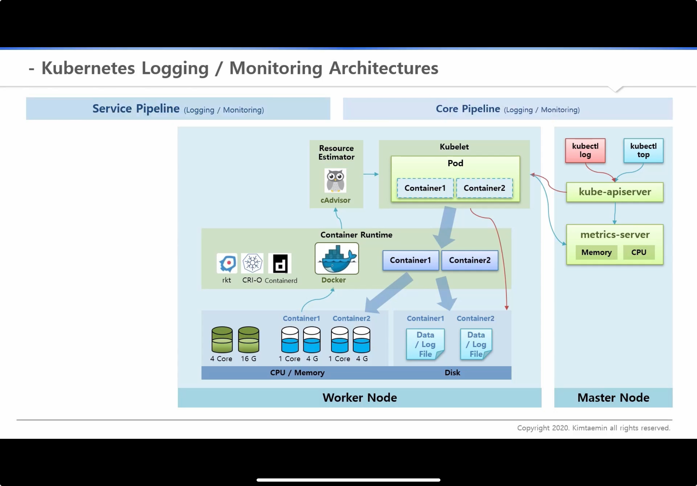
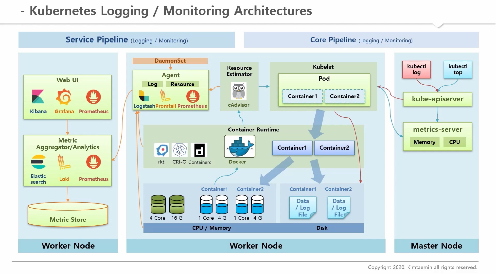

## kube - apiserver

API Server는 쿠버네티스 API를 노출하는 쿠버네티스 컨트롤 플레인 컴포넌트이다. API 서버는 쿠버네티스 컨트롤 플레인의 프론트엔드라고 할 수 있음

`컨트롤 플레인이란?`

> 컨테이너의 라이프사이클을 정의, 배포, 관리하기 위한 API와 인터페이스들을 노출하는 컨테이너 오케스트레이션 레이어이다

### etcd란

모든 클러스터 데이터를 담는 쿠버네티스 뒷단의 저장소로 사용되는 일관성 및 고가용성 키-값 저장소

### Pod Network

각각의 Pod마다 Physical Network Interface인 etho와 같은 Pod Network 범위 내에서 인터페이스가 생성됨
Pod내 컨테이너들은 해당 인터페이스를 통해 통신할 수 있음
Pod간 네트워킹을 위해서 Network Plugin이 존재함(CNI: Container Network Interface)
Network Plugin의 역할 -> 같은 노드 위의 Pod들간의 통신과 외부 네트워크를 통해 타 노드의 Pod들 간의 통신을 지원함

### Service Network

Service 생성과 동시에 kube-dns에 서비스 네임과 ip가 등록이 됨
api-server가 워커 노드들마다 pod로 띄어져 있는 kube-proxy에 이 서비스가 어느 ip와 연결되어 있는지 정보를 보내줌
NAT 영역에서 서비스 ip를 pod ip로 변경해주는 역할을 함

### Storage

Common, StorageClass, Dynamic Provisioning

각각의 Volume Plugin이 Kubernetes에서 사용할 수 있도록 오픈 소스로 기여되어 있다

PV 특성으로는 Capacity와 accessModes가 있다

Storage Type은 FileStorage, ObjectStorage, BlockStorage가 있다

- BlockStorage: DB 데이터용, StatefulSet

### Kubernetes Logging / Monitoring Architectures

`Kuernetes Core Pipeline`

`Plugin을 설치하는 Service Pipeline`

DaemonSet을 활용한 Agent 영역
그리고 별도의 Worker Node에 Metric Server와 같이 각각의 Node의 Metric들을 분석하고 수집함. 따라서, 별도의 저장소를 구성하고 Web UI를 제공
ex) ELK, Prometheus와 같은 오픈소스를 제공

---

logging이란? 앱의 로그 데이터
monitor : cpu나 memory 자원량

Node-level Logging
`Pod가 살아있을때만 해당 로그가 유지됨`
Termination Message Path를 통해서 Pod가 죽었을때 메시지를 볼 수 있게 해줌

> Kubelet, Container Runtime, Worker Node

Cluster-level Logging

> Pod가 죽으면 Node-Level로 log를 볼 수가 없다 따라서, 클러스터 레벨이 필요한 것이다
> 각각의 Node에 Node Logging Agent를 둠

### References

출처링크 : https://inf.run/yW34
kubernetes Docs : https://kubernetes.io/ko/docs/concepts/overview/components/
